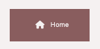
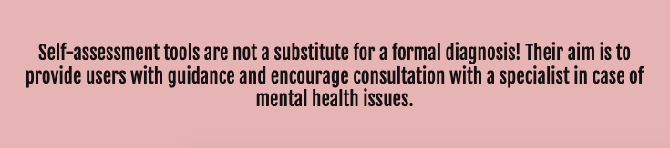
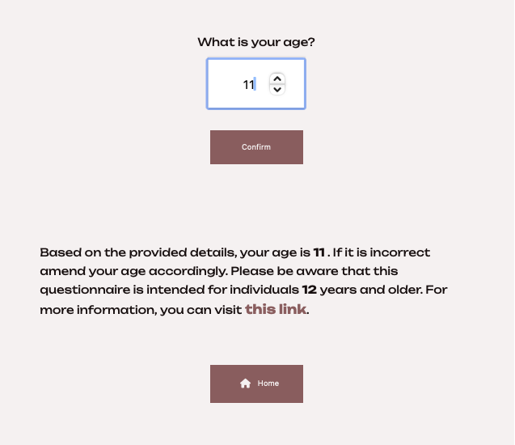
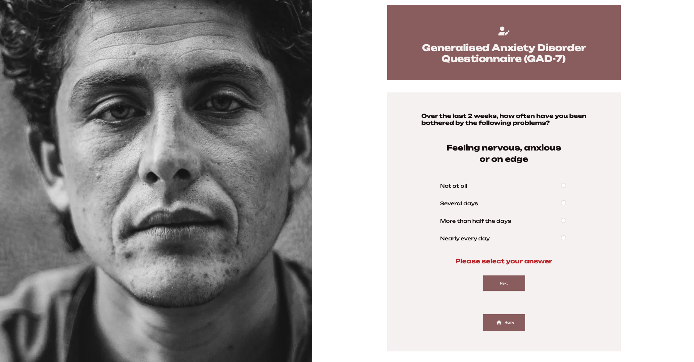
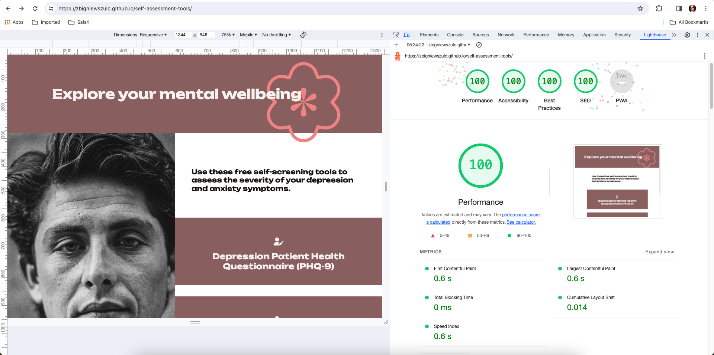
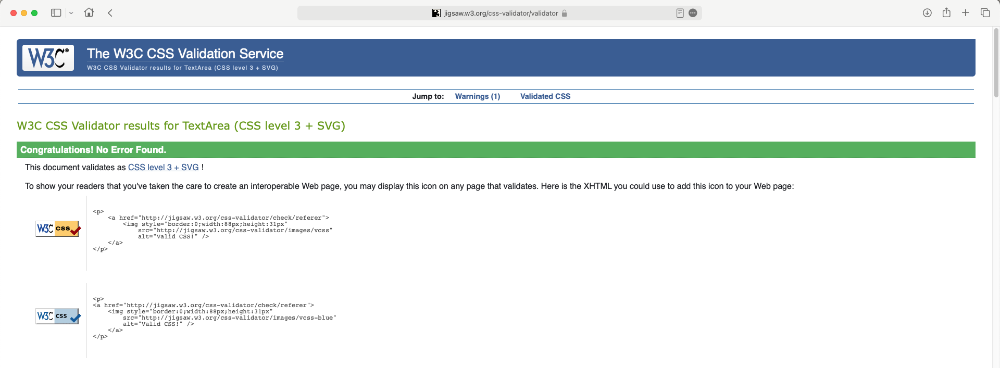

<h1 align="center">Mental Health Screening Tools</h1>

[View the live project here.](https://zbigniewszulc.github.io/self-assessment-tools/)

 
The mental self-assessment online tools were designed to assist people who would like to evaluate the severity of their depression and anxiety symptoms. The website offers two test questionnaires assessing depression and anxiety disorders:
 
               1) PHQ-9 Depression Patient Health Test Questionnaire

               2) GAD-7 General Anxiety Disorder Test Questionnaire
  
After completing each test, the website promptly delivers a personalised result along with tailored recommendations for the user.

It's crafted for responsiveness and accessibility across various devices, ensuring seamless navigation and user-friendly simplicity.
 

## Features
 
-   ### The landing page 
    The landing page introduces the user to a mental self-assessment website and provides a brief description of the website’s aim. The user has an option to take each of two questionnaires and upon clicking on a link, a questionnaire will open. The disclaimer note is displayed in the footer section.
 
    
 
-   ### PHQ-9 Depression Patient Health Test Questionnaire
    Upon clicking on the link on the landing page, the questionnaire will open and the user will be asked to provide his/her age. The questionnaire is designed for people 13 years and older. If the age provided by the user is below 13, a feedback message will appear suggesting a different questionnaire. Upon providing an acceptable age, the user will be presented with 9 questions displayed on individual screens. An answer must be selected in each screen to process to the next question. A test score, severity of the symptoms and a recommendation will be provided at the end of the questionnaire.  The user can click on the Home button or the 'Flower' logo to return to the landing page.

    
 
-   ### GAD-7 General Anxiety Disorder Test Questionnaire
    Upon clicking on the link on the landing page, the questionnaire will open and the user will be asked to provide his/her age. The questionnaire is designed for people 12 years and older. If the age provided by the user is below 12, a feedback message will appear suggesting a different questionnaire. Upon providing an acceptable age, the user will be presented with 7 questions displayed on individual screens. An answer must be selected in each screen to process to the next question. A test score, severity of the symptoms and a recommendation will be provided at the end of the questionnaire.  The user can click on the Home button or the Flower logo to return to the landing page.
 
    
 
- ### Home button
    “Home” button features on all questionnaire pages, allowing the user to easily navigate between pages across all devices without the need to revert back to the previous page via the “back” button. 

    

- ### 5 The Flower - home button
    The flower icon placed in the upper right corner incorporates a concealed home button which upon clicking redirects the user back to the landing page. A pointer cursor will appear when the mouse hovers over the flower icon.    
  
    

-   ### Footer
    The footer disclaimer note appears on all pages reminding the user that the aim of the website is to guide and not to replace a formal medical consultation.
 
    

 
-   ### Age feedback
    An age feedback function is included at the beginning of each questionnaire. The aim of the function is to prevent people under a certain age from accessing the questionnaires and provide an alternative screening options, including links to other resources. Additionally, the user will receive a notification if the age box is left empty.   
 
    

 
-   ### Questionnaire validation
    Each questionnaire is protected with Java script code preventing the user from leaving questions unanswered, i.e. an answer must be selected in each screen to process to the next question.  
 
    

-   ### Navigation buttons
    The “Next” and “Previous” buttons are displayed at the bottom of each questionnaire page giving the user an option to move between questions.
 
    

 
-   ### Multistep form
    A multistep form has been chosen to simplify the lengthy forms making it less overwhelming for the user. It follows a linear progression where the user moves from one step to the next in a sequential order.

 
 
## Testing 
 
During the development process I encountered various bugs and performance related problems and conducted a substantial number of testing. 
 
- ### Goals / Features
    In my opinion all features of the page work as intended, achieving the goals of the project i.e. provide the user with a depression and/or anxiety screening tool and a recommendation based on the answers given in the tests.
 
 
1)  **Landing page**  -   The text description is displayed evenly on the page and in a way it was intended to. 
The color background is displayed correctly and evenly with the recommended level of contrast with accessibility in mind. The links to access both questionnaires are working correctly.
 
2)  **Test Questionnaires** - Both questionnaires work correctly. Questions and answers are displayed as intended. Answers validation function prevents the user from skipping questions. The “Next”, “Previous” and “Home” buttons work as designed. The last page provides a calculated score based on answers given. The result description and recommendation text is displayed correctly.
 
3)  **Home button and Flower logo** - The home button and the flower logo are displayed identically on all pages. Upon clicking on the home button or the flower logo icon in the right upper corner of the page, the user is redirected to the landing page. 
 
4)  **Footer** - The text is displayed evenly and identically on all pages.  
 
5)  **Age feedback** - The interactive feedback works correctly by notifying the user if the age box is left empty. Additionally, if the age given by the user is below required threshold, a feedback message will appear suggesting a different questionnaire.
 
 
 - ### Validation 

    - HTML
      - Validation Tool used: https://validator.w3.org/
      - No errors were found during the initial validation check. However, a total of 8 warnings were identified, all suggesting consideration of using the `<h1>` element as a top-level heading. These warnings stem from the semantic structure employed in the code. They are not critical issues and do not hinder the proper functioning of the webpage as intended.
    

    - Accessiblity validation 
    - Tool used: https://wave.webaim.org and Lighthouse
    - Result: no errors and no recommendations
  
  

    - CSS
      - Validation Tool used: https://validator.w3.org/
      - The CSS validation process did not yield any errors upon the initial attempt.
  

    - JavaScript
      - Validation Tools used: https://jshint.com and https://esprima.org/
      - *Esprima* did not find any mistakes and errors
   
      - *JSHint* did not throw any serious errors in JavaScript code. There are however 3 recommendations: two relates to misleading line break and one referring to functions decalred within loops referencing an outer scoped variable. I have made an attempt to move some functions and variables withing a scope of calling function however the website stopped working correctly. I have reversed the changes back to working state. The misleading line brake is caused by Prettier plugin installed in VS Code - this is not an issue. 
 

- ### Cross-browser testing
  - Online tool used: https://www.browserling.com/browse/win10/vivaldi6.4/https://zbigniewszulc.github.io/self-assessment-tools/
  - Result: no anomalies. All browsers display the content as expected. All website functionality is in place and working correctly.
 
 
## Deployment
  - Procedure for implementing the source code into GitHub Pages:
     1) Log in to GitHub at https://github.com.
     2) Navigate to the project repository. Usually, after logging in, it should be visible in the "Top Repositories" section without the need for further navigation. If not, repositories can always be viewed by clicking on avatar and selecting the "Your repositories" option"
     3) After selecting the repository, find the settings button and go to the Pages tab
     4) Make sure the source section is marked “deploy from a branch” and branch to “main” in the root folder. Press the “Save” button.
     5) This is it. A link for the online page should appear after a minute.
 
## Credits

I sourced my knowledge for creating this website primarily from materials provided by the Code Institute for study purposes. Another resource I frequently consulted was W3Schools. During more challenging moments, I turned to ChatGPT to understand why some of my code snippets weren't functioning as expected.